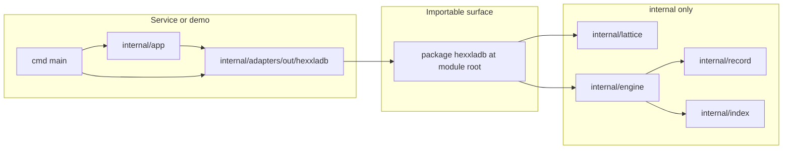

# HexxlaDB — development roadmap

**Audience:** Engineers and agents implementing HexxlaDB and integrating it with the Hexxla service.  
**Status:** Living document; revise as milestones land.

## Purpose

This roadmap defines **phases** from first code to **production-ready** embedded storage, the **canonical folder layout**, **mathematical and ordering contracts**, and **engineering standards** (modern Go + hexagonal boundaries). It does not replace the normative specs; it sequences work and records cross-cutting decisions.

## Document references

| Document | Role |
| -------- | ---- |
| [HEXXLA_DB.md](./HEXXLA_DB.md) | Storage layout, keys, indexes, engine stance, native query primitives. |
| [HEXXLA.md](./HEXXLA.md) | Hexxla **memory model**, **geometry**, **retrieval / context ordering**, facets, seams (product spec the database supports). |
| [HEXXLA_DB_V1.md](../checklist/HEXXLA_DB_V1.md) | v1 engineering checklist and resolved decisions. |
| [HEXAGONAL_ARCHITECTURE.md](../context/HEXAGONAL_ARCHITECTURE.md) | Ports, adapters, `cmd` composition, CI entrypoints. |
| [MODERN_GO.md](../context/MODERN_GO.md) | Go 1.21–1.26 release inventory; use as a lookup for stdlib and toolchain behavior. |
| [AGENTS.md](../../AGENTS.md) | Agent instructions; keep this roadmap updated when milestones or scope change (see roadmap section there). |
| [H3_REFERENCE.md](./H3_REFERENCE.md) | Uber H3 vs HexxlaDB: what to borrow (testing, bit-layout discipline) vs what not to port. |
| [MVCC_DESIGN.md](./MVCC_DESIGN.md) | MVCC / `as_of` snapshot model, WAL/GC/migration. E2+ MVP shipped; follow-ons focus on GC/time-to-seq mapping/ops hardening. |

**Split of concerns:** Normative **distance, neighbors, ring / `load_context` ordering** are in **HEXXLA.md**. **Keys, Morton keyspace, WAL, record families** are in **HEXXLA_DB.md**. Implementations must stay consistent with both.

## Mathematical and ordering reference

Shared vocabulary for lattice code and tests.

### Axial and cube coordinates

Axial coordinates \((q, r)\) with implicit cube coordinate \(s = -q - r\) (constraint \(q + r + s = 0\)).

### Hex distance

[HEXXLA.md](./HEXXLA.md) (Geometric Model) gives the axial form (equivalent to cube Manhattan divided by 2):

\[
d = \frac{|q_a - q_b| + |r_a - r_b| + |(q_a + r_a) - (q_b + r_b)|}{2}
\]

This matches \((|dq| + |dr| + |ds|) / 2\) with \(s = -q - r\).

### Ring and ball counts

- **Ring 0:** exactly **1** cell (the center).
- **Ring \(k \geq 1\)** (exact shell at distance \(k\)): **\(6k\)** cells.
- **Ball of radius \(R\)** (all cells with distance \(\leq R\) from center):

\[
N(R) = 1 + \sum_{k=1}^{R} 6k = 1 + 3R(R+1)
\]

**Checklist note:** [HEXXLA_DB_V1.md](../checklist/HEXXLA_DB_V1.md) mentions ring cell counts with a different formula; treat **shell = \(6k\)** and **ball = \(1 + 3R(R+1)\)** as canonical here and align checklist wording in a future edit if needed.

### Zigzag and Morton (`PackedCoord`)

- **Zigzag:** map signed integer coordinates to unsigned for Morton interleaving (e.g. per 64-bit coordinate, \(zigzag(n) = (n \ll 1) \oplus (n \gg 63)\)); document **coordinate bounds** in `internal/lattice` once fixed.
- **Morton / Z-order:** interleave bits of zigzag-encoded cube coordinates into **`PackedCoord`**. The v1 checklist fixes **`PackedCoord`** as **`[2]uint64`** (128 bits)—see **PackedCoord bit layout** below.

### Seam endpoint canonicalization

Total order on **`PackedCoord`**. Secondary index entries use **\((\min(a,b), \max(a,b), \text{ulid})\)** per [HEXXLA_DB.md](./HEXXLA_DB.md) Storage Layout (`seam-by-cells/...`).

### Ring and context iteration (product-normative)

[HEXXLA.md](./HEXXLA.md) (`load_context` output ordering): **concentric rings from center outward**, then **axial spiral order within each ring starting from the positive-q direction**; token budget may trim from outer rings / lower-confidence items first.

**Coord.Ring**, **WalkRing**, and **LoadContext** should match this ordering so persistence and API behavior are deterministic relative to the Hexxla spec.

## PackedCoord bit layout (design gate)

`PackedCoord` is **`[2]uint64`** (128 bits: **high** word / **low** word—assign **Hi/Lo** when implementing and document the choice). Before persisting engine keys, **lock down** the following (and mirror them as package docs in **`internal/lattice`**):

1. **Zigzag widths / coordinate bounds:** number of bits per axis after zigzag-encoding \(q', r', s'\), and the **valid world extent** (min/max axial or cube values) those bits cover. Saturation or overflow behavior for out-of-range coords must be explicit (reject vs clamp).
2. **Morton interleave order:** the order in which bits from \(q'\), \(r'\), and \(s'\) are merged (e.g. fixed cyclic \(q_0, r_0, s_0, q_1, \ldots\)) and how that maps to **bit indices** in the 128-bit value. Any difference between “logical” Morton order and **on-disk key byte order** must be documented so range scans stay consistent.
3. **128-bit packing map:** three-way interleaving naturally spans up to **192** bits of payload; fitting into **128** bits requires a **defined** truncation, **folding**, or **reserved high bits** strategy (e.g. super-hex region prefix in the high word). The **total order** on `PackedCoord` used for seam canonicalization must match this map.
4. **Versioning:** **magic** and **format version** in the engine header (see [HEXXLA_DB_V1.md](../checklist/HEXXLA_DB_V1.md)) must change if the packing map changes incompatibly.

The v1 layout is implemented and documented in [`internal/lattice/PACKED_COORD.md`](../../internal/lattice/PACKED_COORD.md) and package docs in [`internal/lattice`](../../internal/lattice/doc.go). Until persisted engine keys exist, treat any future incompatible change as requiring a format bump per the gate above.

## Architecture mapping (hexagonal + library)



- **`internal/domain`** / **`internal/app`:** define **ports** (interfaces) for product behavior; **no** imports of concrete adapters.
- **`package hexxladb` (module root):** stable **`Open`**, **`DB`**, **`View`/`Update`**, **`Tx`**, and query primitives per [HEXXLA_DB_V1.md](../checklist/HEXXLA_DB_V1.md).
- **`internal/adapters/out/hexxladb`:** implements app ports by calling **only** the public **`hexxladb`** API (no direct `internal/engine` from adapters).
- **`cmd/...`:** sole **composition root**—config, construct DB, inject into `app`.

## Proposed repository layout

Target shape (v1: no **`pkg/`** unless a second stable surface is needed later):

```text
github.com/hexxla/hexxladb/
├── go.mod
├── db.go                 # package hexxladb — Open, DB, Options
├── tx.go                 # View / Update / Tx
├── doc.go
├── errors.go             # sentinel errors; errors.Is / errors.As
├── internal/
│   ├── lattice/          # Coord, PackedCoord, zigzag, Morton, rings (stdlib only)
│   ├── record/           # versioned envelopes; Cell, Facet, Edge, Seam codecs
│   ├── engine/           # pages (64 KiB), file header, WAL, page I/O, ordered store
│   ├── index/            # key encoding; internal secondaries
│   ├── app/
│   ├── domain/
│   ├── config/
│   └── adapters/
│       ├── in/           # HTTP, gRPC, CLI — add when needed
│       └── out/
│           └── hexxladb/ # port impl over public hexxladb API
├── cmd/
│   └── hexxladb/   # example composition root (reference wiring)
└── docs/
    └── hexxladb/
        ├── HEXXLA_DB.md
        ├── HEXXLA.md
        └── DEVELOPMENT_ROADMAP.md
```

## Milestones

Each milestone should end with **`make ci`** green ([HEXAGONAL_ARCHITECTURE.md](../context/HEXAGONAL_ARCHITECTURE.md)).

**Dependency sketch:** M1 (lattice) before M3–M4; M2 (records) before M4; M4 before M5–M6; M5 (Tx API) wraps the ordered store.

| Phase | Focus | Exit criteria (examples) |
| ----- | ----- | ------------------------ |
| **M0** | Repo hygiene | Root `package hexxladb` skeleton; `internal/lattice` exists; docs reference spec + checklist. |
| **M1** | Lattice | `Coord` / `PackedCoord`; **documented** zigzag + Morton layout; distance, neighbors, **ring iteration** aligned with [HEXXLA.md](./HEXXLA.md); tests for symmetry, ball \(1+3R(R+1)\), shell \(6k\). |
| **M2** | Records | Versioned envelopes; Cell, Facet, Seam (ULID), Edge codecs; reject unknown newer `format_version`. |
| **M3** | Engine shell | 64 KiB pages; single DB file + WAL; header; redo WAL; replay on `Open`; **page read/write hooks** for optional encryption. |
| **M4** | Ordered store | Morton-prefixed keys in an owned structure (e.g. B+-tree); range scans support ring-shaped access patterns. |
| **M5** | Public Tx API | `Open` / `Close`, `View` / `Update`, `*Tx`; single writer, multiple readers; shape compatible with future MVCC. |
| **M6** | Core primitives | `PutCell`, `WalkRing`, `FindSeams`; early `LoadContext`, `ResolveSeam`; stable sentinel errors. |
| **M7** | Indexes | `seam-by-cells` secondary; tag/source indexes internal unless a milestone promotes them. |
| **M8** | Durability | Integration tests: WAL replay, crash during write; optional `//go:build integration` for heavier cases. |
| **M9** | Encryption (optional) | AES-256-XTS at data-page boundary (length-preserving); optional Argon2id passphrase KDF; WAL stores ciphertext; threat model in ENCRYPTION.md. |
| **M10** | Production readiness | Benchmarks (lattice, scans); fuzz decoders; semver / compatibility policy; operator notes in docs. |

### M0 complete (2026-04-13)

- Root **`package hexxladb`**: [`doc.go`](../../doc.go), [`errors.go`](../../errors.go), [`options.go`](../../options.go), [`db.go`](../../db.go) ([`Open`](../../db.go)/[`Close`](../../db.go)); [`tx.go`](../../tx.go) gained **[`View`](../../tx.go)/[`Update`](../../tx.go)** in **M5**; tests in [`db_test.go`](../../db_test.go).
- **`internal/lattice`**: axial [`Coord`](../../internal/lattice/coord.go), [`Distance`](../../internal/lattice/coord.go), tests.
- Placeholder **README** trees: [`internal/engine`](../../internal/engine/README.md), [`internal/record`](../../internal/record/README.md), [`internal/index`](../../internal/index/README.md), [`internal/adapters/out/hexxladb`](../../internal/adapters/out/hexxladb/README.md).
- Checklist [§2](../checklist/HEXXLA_DB_V1.md#2-module-and-package-layout) layout items ticked.

### M1 complete (2026-04-13)

- **`PackedCoord`** as [`[2]uint64`](../../internal/lattice/packed.go); zigzag + 63-bit Morton (21-bit limbs, cyclic `q,r,s`) with **`Hi` reserved / `Lo` payload** — see [`internal/lattice/PACKED_COORD.md`](../../internal/lattice/PACKED_COORD.md).
- **`Pack` / `Unpack`** with **`ErrCoordOutOfRange`** and documented axial bounds ([`MaxAxialAbs`](../../internal/lattice/bounds.go)); **`PackedCoord.Compare`** total order for seam-style canonicalization.
- **`Neighbors`**, **`Ring`**, **`WalkRings`** aligned with [HEXXLA.md](./HEXXLA.md) `load_context` ordering (Red Blob Games ring walk from **+q**).
- Tests: ball **\(1+3R(R+1)\)**, shell **\(6k\)**, ring golden order **k=1..2**, pack round-trip, symmetry.
- Root [`coord_export.go`](../../coord_export.go) forwards **`Coord`**, **`PackedCoord`**, **`Cube`**, **`Pack`**, **`Unpack`**, **`Ring`**, **`WalkRings`**, **`ErrCoordOutOfRange`**, **`MaxAxialAbs`** for external importers.

### M2 complete (2026-04-13)

- **`internal/record`**: versioned envelope (**magic** + **`format_version`** `uint16` + **`payload_len`** `uint32`, big-endian) and **v1** payloads for **Cell**, **Facet**, **Edge**, **Seam** — see [`FORMAT.md`](../../internal/record/FORMAT.md).
- **Version policy:** decode **`format_version == 1`** only; **`format_version > 1`** → **`ErrUnsupportedFormatVersion`**; older / zero → **`ErrUnknownFormatVersion`**.
- **Seam** IDs: **ULID** via [`github.com/oklog/ulid/v2`](https://pkg.go.dev/github.com/oklog/ulid/v2); **Facet** **`DerivationHash`**: **SHA-256** raw bytes ([`HashRawContent`](../../internal/record/hash.go)).
- **`CanonicalCellPair`** for **`seam-by-cells`** endpoint ordering ([HEXXLA_DB.md](./HEXXLA_DB.md) storage layout).
- Tests: round-trip, golden header checks, unsupported version rejection, hash/ULID vectors.

**Parallel track:** Add **`internal/adapters/out/hexxladb`** and app ports once **`PutCell`** / **`WalkRing`** exist, so the service stays decoupled from `internal/engine`.

### M3 complete (2026-04-13)

- **`internal/engine`**: **64 KiB** [`PageSize`](../../internal/engine/const.go); primary file + `{path}-wal`; **512-byte** header prefix on page 0 — see [`ENGINE_FORMAT.md`](../../internal/engine/ENGINE_FORMAT.md).
- **Redo WAL** (`seq`, `page_id`, CRC32, full page); **replay on `Open`**; WAL **truncated** after successful replay; **[`PageHooks`](../../internal/engine/hooks.go)** (`BeforeWrite` / `AfterRead`) at the page boundary.
- **Root [`Open`](../../db.go) / [`Close`](../../db.go)** delegate to the engine; **[`Options`](../../options.go)** maps optional hook funcs; public **[`ErrCorruptDatabase`](../../db.go)** wraps corrupt header/WAL from open.
- Tests: header round-trip, WAL parse/idempotency, `Open` + pending WAL replay, write/read/reopen smoke ([`internal/engine/*_test.go`](../../internal/engine/)); [`db_test.go`](../../db_test.go) exercises public open/close.

### M4 complete (2026-04-13)

- **[`internal/index`](../../internal/index):** **`cell/`** keys via [`CellKey`](../../internal/index/cell_key.go) / [`ParseCellKey`](../../internal/index/cell_key.go) — **big-endian Hi/Lo** so lexicographic order matches [`PackedCoord.Compare`](../../internal/lattice/packed.go).
- **[`internal/engine`](../../internal/engine):** **B+ tree** on [`Engine`](../../internal/engine/engine.go) pages — [`OpenBTree`](../../internal/engine/btree.go), [`BTree.Get`](../../internal/engine/btree.go) / [`Put`](../../internal/engine/btree.go) / [`AscendRange`](../../internal/engine/btree.go); file header **`btree_root_page`** (offset 32) — **[`ORDERED_STORE.md`](../../internal/engine/ORDERED_STORE.md)**, **[`ENGINE_FORMAT.md`](../../internal/engine/ENGINE_FORMAT.md)** update.
- Tests: btree stress insert, range scan, **ring / `WalkRings`** vs Morton sort ([`btree_ring_test.go`](../../internal/engine/btree_ring_test.go)); index key order ([`cell_key_test.go`](../../internal/index/cell_key_test.go)).

### M5 complete (2026-04-13)

- **[`DB.View`](../../tx.go) / [`Update`](../../tx.go)** with **`sync.RWMutex`**: many concurrent readers, exclusive writer; **[`Close`](../../db.go)** waits for in-flight txs. See **[`docs/hexxladb/TX.md`](./TX.md)**.
- **[`Tx`](../../tx.go):** [`Get`](../../tx.go), [`Put`](../../tx.go), [`AscendRange`](../../tx.go), [`Writable`](../../tx.go) — byte-key ordered store over **[`internal/engine`](../../internal/engine)** [`BTree`](../../internal/engine/btree.go) (M6 adds **`PutCell`** / domain APIs).
- Sentinels: [`ErrDatabaseClosed`](../../errors.go), [`ErrTxReadOnly`](../../errors.go), [`ErrNilCallback`](../../errors.go) ([`errors.go`](../../errors.go)).
- Tests: [`db_test.go`](../../db_test.go) — KV round-trip, read-only enforcement, closed DB, concurrent `View`, `Update` blocks `View`, **`-race`**.

### M6 complete (2026-04-13)

- **[`Tx`](../../tx.go) primitives** ([`primitives.go`](../../primitives.go)): [`PutCell`](../../primitives.go), [`GetCell`](../../primitives.go), [`WalkRing`](../../primitives.go) (`context.Context` + ring distance), [`PutSeam`](../../primitives.go), [`FindSeams`](../../primitives.go) (M6: primary **`seam/<ulid>`** scan; superseded by M7 secondary—see **M7 complete**), [`LoadContext`](../../primitives.go) ([`WalkRings`](../../coord_export.go) order, `maxCells` cap), [`ResolveSeam`](../../primitives.go). New sentinels: [`ErrSeamNotFound`](../../errors.go), [`ErrInvalidArgument`](../../errors.go).
- **Keys:** [`internal/index`](../../internal/index) [`CellKey`](../../internal/index/cell_key.go), [`SeamKey`](../../internal/index/seam_key.go) / [`SeamScanUpperBound`](../../internal/index/seam_key.go); records via [`internal/record`](../../internal/record).
- **Port:** [`internal/domain/storage.go`](../../internal/domain/storage.go) [`Storage`](../../internal/domain/storage.go); adapter [`internal/adapters/out/hexxladb/storage.go`](../../internal/adapters/out/hexxladb/storage.go) ([`hexxladbout.NewStorage`](../../internal/adapters/out/hexxladb/storage.go)) calls only **`package hexxladb`**.
- **Guardrails:** [`AGENTS.md`](../../AGENTS.md) / [`.cursor/rules/00-core-project.mdc`](../../.cursor/rules/00-core-project.mdc) (no `internal/engine` or `internal/index` in domain/app); [`scripts/check-hex-boundaries.sh`](../../scripts/check-hex-boundaries.sh) in [`scripts/ci.sh`](../../scripts/ci.sh).
- **Scope note (historical):** M6 **`FindSeams`** used a primary scan only; M7 adds **`seam-by-cells`**. **`LoadContext`** still uses a cell count cap instead of a full token-budget model until product metrics exist.
- Tests: [`primitives_test.go`](../../primitives_test.go); **`make ci`** green.

### M7 complete (2026-04-13)

- **Secondary index:** [`internal/index/seam_by_cells.go`](../../internal/index/seam_by_cells.go) — [`SeamByCellsKey`](../../internal/index/seam_by_cells.go), [`ParseSeamByCellsKey`](../../internal/index/seam_by_cells.go), range helpers [`SeamByCellsRangeLoFixed`](../../internal/index/seam_by_cells.go) / [`SeamByCellsRangeHiFixedLoLess`](../../internal/index/seam_by_cells.go); empty value at secondary keys; layout matches [HEXXLA_DB.md](./HEXXLA_DB.md) `seam-by-cells/<packed_a>/<packed_b>/<ulid>`.
- **[`Tx.PutSeam`](../../primitives.go)** dual-writes primary + secondary; **[`ErrSeamEndpointMismatch`](../../errors.go)** if an existing ULID’s endpoints would change (no B+tree **`Delete`** yet).
- **[`Tx.FindSeams`](../../primitives.go)** walks the **ball** ([`WalkRings`](../../coord_export.go)) and queries secondaries per cell (incident seams: canonical `lo==P` or `hi==P` with `lo<P`); **ULID dedupe**; loads full records from **`seam/<ulid>`** primaries.
- **Not in M7:** tag/source secondaries ([roadmap table](#milestones)); DBs with only M6 primaries need seams **re-put** (or a future reindex tool) for **`FindSeams`** to see them.
- Tests: [`internal/index/seam_by_cells_test.go`](../../internal/index/seam_by_cells_test.go), [`primitives_test.go`](../../primitives_test.go); **`make ci`** green.

### M8 complete (2026-04-13)

- **Public API durability:** [`db_durability_test.go`](../../db_durability_test.go) — committed KV and **`PutCell`** data survives **`Close`** + **`Open`**; pending WAL file (`{path}-wal` per [ENGINE_FORMAT.md](../../internal/engine/ENGINE_FORMAT.md)) replays on **`Open`** (test-encoded record matches [internal/engine/wal.go](../../internal/engine/wal.go)); verifies DB remains writable/readable after replay.
- **Optional integration tag:** [`durability_integration_test.go`](../../durability_integration_test.go) (`//go:build integration`) — many puts + reopen; run **`make integration`** ([CONTRIBUTING.md](../../CONTRIBUTING.md)); **not** in default **`make ci`**.
- **Scope:** process **`SIGKILL`** / mid-write chaos tests not shipped—follow-up if needed. Default CI stays fast.

### M9 complete (2026-04-13)

- **At-rest encryption:** [`Options.EncryptionKey`](../../options.go) / [`Options.Passphrase`](../../options.go) — **AES-256-XTS** on data pages (**≥ 1**); **HKDF** + optional **Argon2id** ([`encryption.go`](../../encryption.go)); header **`Features`** / **`EncryptionSalt`** ([`internal/engine/header.go`](../../internal/engine/header.go)); **[`ENGINE_FORMAT.md`](../../internal/engine/ENGINE_FORMAT.md)** + **[`ENCRYPTION.md`](./ENCRYPTION.md)**.
- **WAL:** redo records store **post-hook** page bytes (**ciphertext** when enabled), consistent with the primary file — see **WAL policy** in [`ENCRYPTION.md`](./ENCRYPTION.md).
- **API:** [`ErrEncryptionKeyRequired`](../../errors.go), [`ErrDatabaseNotEncrypted`](../../errors.go), [`ErrEncryptionOptions`](../../errors.go), [`ErrEncryptionKeyMismatch`](../../errors.go); [`PageHooks`](../../internal/engine/hooks.go) take **`pageID`** for tweak/nonce schemes.
- **Tests:** [`encryption_test.go`](../../encryption_test.go), [`db_encryption_test.go`](../../db_encryption_test.go); **`make ci`** green.
- **Scope cuts:** no AEAD/authentication layer in v1 (XTS only); memory hardening deferred.

### M10 complete (2026-04-13)

- **Benchmarks:** [`internal/lattice/packed_bench_test.go`](../../internal/lattice/packed_bench_test.go) (`Pack` / `Unpack` / `Compare` / `Distance`); [`internal/engine/btree_bench_test.go`](../../internal/engine/btree_bench_test.go) (`Get` / `Put` / `AscendRange`); [`internal/record/cell_bench_test.go`](../../internal/record/cell_bench_test.go) (`Encode`/`Decode` cell). Run: **`make bench`** ([`Makefile`](../../Makefile)).
- **Fuzz:** [`internal/record/fuzz_test.go`](../../internal/record/fuzz_test.go) (`FuzzDecodeCell`); [`internal/engine/fuzz_test.go`](../../internal/engine/fuzz_test.go) (`FuzzDecodeHeaderPage`, `FuzzParseAndReplayWAL`). Run: **`make fuzz`** or `go test -fuzz=...` (see [`CONTRIBUTING.md`](../../CONTRIBUTING.md)).
- **Versioning:** [`VERSIONING.md`](../../VERSIONING.md) — module semver, on-disk `format_version`, `internal/*` vs public API.
- **Operations:** [`OPERATIONS.md`](./OPERATIONS.md) — primary + WAL paths, backup/snapshot guidance, encryption pointer, observability note.
- **`make ci`** green.

### Phase C complete (spec integration track)

- **Read filters (not MVCC):** [`record.ValidAt`](../../internal/record/validity.go) — half-open **`[ValidFrom, ValidTo)`** on **`ValidityWire`**; **[`Tx.WalkRingAt`](../../primitives.go)** and **[`Tx.LoadContextAt`](../../primitives.go)** skip cells outside **`asOf`**.
- **Facet ring loads:** **[`Tx.WalkRingFacets`](../../primitives.go)** — 6-bit **`facetMask`** for **`facet_id`** **`0..5`**, optional **`asOf`** on the cell; cost documented in **[`TX.md`](./TX.md)**.
- **Port:** [`domain.Storage`](../../internal/domain/storage.go) + [`hexxladbout`](../../internal/adapters/out/hexxladb/storage.go); tests [`phase_c_test.go`](../../phase_c_test.go), [`internal/record/validity_test.go`](../../internal/record/validity_test.go).
- **Consolidated readiness status:** [`HEXXLA_READINESS_ROADMAP.md`](./HEXXLA_READINESS_ROADMAP.md).

### Phase D complete (spec integration track)

- **Secondary indexes:** [`internal/index/source_key.go`](../../internal/index/source_key.go), [`time_key.go`](../../internal/index/time_key.go); **[`engine.BTree.Delete`](../../internal/engine/btree_delete.go)** for stale keys; **[`Tx.PutCell`](../../primitives.go)** dual-write; **[`Tx.AscendCellsBySource`](../../cell_secondary.go)**, **[`Tx.AscendCellsInTimeBucket`](../../cell_secondary.go)**.
- **Port:** [`domain.Storage`](../../internal/domain/storage.go) + [`hexxladbout`](../../internal/adapters/out/hexxladb/storage.go); tests [`phase_d_test.go`](../../phase_d_test.go), [`internal/engine/btree_test.go`](../../internal/engine/btree_test.go) (`TestBTree_delete`).
- **Gaps:** see consolidated list in [`HEXXLA_READINESS_ROADMAP.md`](./HEXXLA_READINESS_ROADMAP.md).

### Phase E — design + E1 prototype (MVCC / `as_of`)

- **Design doc:** [`MVCC_DESIGN.md`](./MVCC_DESIGN.md) — snapshot identity, version storage options, visibility, WAL, GC, migration, decision log.
- **E1:** Option A experiment [`internal/mvccspike`](../../internal/mvccspike) informed production key layout.
- **E2+ MVP shipped:** format v2 + `commit_seq`, `ViewAt(read_seq)`, version-suffixed key families for cells/facets/cell secondaries.
- **Remaining follow-ons:** version GC/reclamation, wall-clock mapping to `read_seq`, and operational tooling.

### Phase F complete (spec integration track)

- **Public API:** **[`DB.Batch`](../../db.go)** — alias for **[`DB.Update`](../../db.go)**; locking and semantics identical ([`TX.md`](./TX.md)).
- **Tests:** [`db_test.go`](../../db_test.go).
- **Consolidated readiness status:** [`HEXXLA_READINESS_ROADMAP.md`](./HEXXLA_READINESS_ROADMAP.md).

### Phase G complete (spec integration track)

- **Logical changefeed:** [`internal/changelog`](../../internal/changelog); **[`Options`](../../options.go)** `ChangelogEnabled` / `ChangelogPath` / `ChangelogLazy`; **[`DB.ReadChangelogSince`](../../db_changelog.go)**; docs [`CHANGEFEED.md`](./CHANGEFEED.md).
- **Tests:** [`internal/changelog/changelog_test.go`](../../internal/changelog/changelog_test.go), [`db_test.go`](../../db_test.go).
- **Consolidated readiness status:** [`HEXXLA_READINESS_ROADMAP.md`](./HEXXLA_READINESS_ROADMAP.md).

### Post–G — Seam `ValidityWire` + seam secondaries (spec §4.2 / Phase D)

- **Wire:** [`SeamRecord.Validity`](../../internal/record/types.go), [`SeamRecord.Provenance`](../../internal/record/types.go) — trailing suffixes on seam payload v1 ([`internal/record/seam.go`](../../internal/record/seam.go), [`FORMAT.md`](../../internal/record/FORMAT.md)).
- **API:** **[`Tx.FindSeamsAt`](../../primitives.go)**; **[`Tx.AscendSeamsBySource`](../../seam_secondary.go)**, **[`Tx.AscendSeamsInTimeBucket`](../../seam_secondary.go)**; **[`domain.Storage`](../../internal/domain/storage.go)** + **[`hexxladbout`](../../internal/adapters/out/hexxladb/storage.go)**.
- **Indexes:** [`internal/index/seam_secondary_keys.go`](../../internal/index/seam_secondary_keys.go) (`seam-source/`, `seam-time/`); dual-write on **[`PutSeam`](../../primitives.go)**.
- **Tests:** [`internal/record/record_test.go`](../../internal/record/record_test.go), [`phase_c_test.go`](../../phase_c_test.go), [`seam_secondary_test.go`](../../seam_secondary_test.go).
- **Docs:** [`TX.md`](./TX.md); [`HEXXLA_READINESS_ROADMAP.md`](./HEXXLA_READINESS_ROADMAP.md).

## Testing strategy

- **Default:** `go test ./...` stays **fast**—pure tests for `internal/lattice`, `internal/record`, fakes / memory adapters for `internal/app`.
- **Integration:** real temp files, WAL replay, optional process-kill tests behind **`integration`** build tag if needed. **Scale:** [`scale_integration_test.go`](../../scale_integration_test.go) (`make integration`) loads **10k** cells ( **1k** with `-short`), secondaries, and reopen checks. **Stress:** [`stress_integration_test.go`](../../stress_integration_test.go) (`make stress`, tag **`stress`**) defaults to **100k** cells (`HEXXLA_STRESS_CELLS`, max 500k).
- **Benchmarks:** `testing.B.Loop` where appropriate ([MODERN_GO.md](../context/MODERN_GO.md)); lattice and scan hot paths; public API benches in [`api_bench_test.go`](../../api_bench_test.go) with **`cells_N`** sub-benchmarks (`make bench` / `make bench-stress`; **`HEXXLA_BENCH_PRELOAD=all`** adds 10k; **`extreme`** adds 50k and needs large **`TMPDIR`**).
- **Example CLI:** [`cmd/hexxladb/main.go`](../../cmd/hexxladb/main.go) supports **`-demo`** / **`-path`** / **`-cells`**; **[`examples/storage_walkthrough`](../../examples/storage_walkthrough/main.go)** runs every **[`domain.Storage`](../../internal/domain/storage.go)** method in one script (see [README](../../README.md)).

## Production-ready definition

- **Correctness:** crash recovery verified; format versioning documented.
- **CI parity:** `make ci` matches repo gate (fmt, vet, test -race, vuln, lint, mod tidy).
- **Observability:** structured logging (`log/slog`) in **`cmd`** and adapters, not business rules in **`internal/domain`**.
- **Security (when encryption ships):** threat model documented (at-rest vs WAL policy).

## Engineering standards (modern Go)

- Honor **`go`** version in `go.mod`; use [MODERN_GO.md](../context/MODERN_GO.md) as a **reference** for stdlib and toolchain features, not a checklist to use every API.
- Prefer **`context`**, **`errors.Is` / `errors.As`** for stable errors on the public API.
- Hot lattice paths: **stdlib only**, no `math/big` on hot paths for **`PackedCoord`** ([HEXXLA_DB_V1.md](../checklist/HEXXLA_DB_V1.md)).

## Open points

- **MVCC / `as_of`:** design `View`/`Tx` so snapshot isolation can land post-v1 without breaking callers.
- **Next milestone (suggested):** **post-E2+ hardening** — transaction late-failure semantics, MVCC GC/reclamation, context/ops ergonomics, and benchmark+usage baselines.

---

*For v1 scope and non-goals, see [HEXXLA_DB.md](./HEXXLA_DB.md) and [HEXXLA_DB_V1.md](../checklist/HEXXLA_DB_V1.md).*
