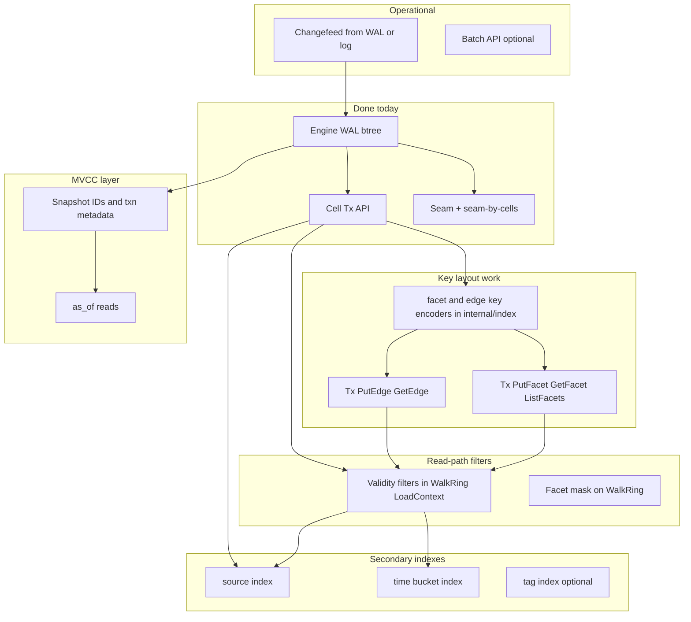

# HEXXLA_DB.md — gap analysis and integration plan

**Normative spec:** [`HEXXLA_DB.md`](./HEXXLA_DB.md) (v1.3).  
**Purpose:** Deep comparison of the specification to the current codebase, then a **phased plan** to integrate missing capabilities without pretending the v1 milestone already shipped them.

---

## 1. Executive summary

The spec mixes three layers:

1. **Locked architecture** — custom embedded engine, Morton keys, WAL, hex-native primitives — **largely implemented**.
2. **v1 scope (spec §“v1 Scope and Non-Goals”)** — cells, facets, edges, seams, validity fields, core primitives, no ANN — **partially implemented** (Cell + Seam are first-class on `Tx`; Facet/Edge records exist in `internal/record` but have **no** public `Tx` APIs or stable key helpers in `internal/index`).
3. **Long-term product** — MVCC, `as_of`, `time/` / `source/` keyspaces, changefeeds, sharding, tiering — **not implemented**; requires **major engine and API design** beyond current B+tree + single-writer `View`/`Update`.

**“We should have been doing this from the start”** is addressed by ordering work below: **complete the v1-shaped surface** (Facet/Edge/primitives parity) **before** taking on MVCC or secondary temporal/source indexes, which depend on a snapshot or versioning story.

---

## 2. Section-by-section mapping

### 2.1 Architecture position (spec §“HexxlaDB Architecture Position”)

| Spec item | Status | Notes |
|-----------|--------|--------|
| Custom engine, no SQLite/third-party KV core | **Shipped** | [`internal/engine`](../../internal/engine) |
| Morton `PackedCoord` + B+ tree | **Shipped** | [`internal/lattice`](../../internal/lattice), [`internal/engine/btree.go`](../../internal/engine/btree.go) |
| Ring walks as range scans | **Partial** | [`WalkRing`](../../primitives.go) iterates ring coords and does `Get` per cell; not a single prefix scan over a Morton ring projection (spec allows both approaches). |
| Edge vs Seam distinct families | **Partial** | Seam: primary + `seam-by-cells` secondary. Edge: **encode/decode only** — no `edge/...` keys on `Tx`. |
| MVCC for `as_of` | **Missing** | Single committed snapshot; [`TX.md`](./TX.md) documents forward-compat only. |
| Package layout `Open, DB, Batch` | **Shipped** | **[`DB.Batch`](../../db.go)** aliases **[`DB.Update`](../../db.go)**; Bolt-style `View`/`Update`/`Tx` remains the primary surface ([`TX.md`](./TX.md)). |

### 2.2 Core data model (spec §“Core Data Model”)

| Object | Spec keys / indexes | Status |
|--------|----------------------|--------|
| **Cell** | `cell/<packed>`, indexes: source, tags, validity | **Primary shipped**; **secondary indexes for `source_id`, tags, validity** — **not implemented** (only coordinate primary via btree). |
| **Facet** | `facet/<packed>/<facet_id>` | **Record codecs shipped** ([`internal/record/facet.go`](../../internal/record/facet.go)); **no `Tx.PutFacet` / `GetFacet`**; no `internal/index` key layout. |
| **Edge** | `edge/<from>/<to>/<type>` | **Record codecs shipped**; **no `Tx` APIs**; no index keys. |
| **Seam** | `seam/<ulid>`, `seam-by-cells/...` | **Shipped** ([`PutSeam`](../../primitives.go), [`FindSeams`](../../primitives.go)). |
| **Validity / temporal** | `as_of`, `valid_during` | **Fields on records**; **no MVCC**; **no `time/` index**; queries do not filter by validity window in the engine. |

### 2.3 Storage layout (spec §“Storage Layout”)

| Keyspace | Status |
|----------|--------|
| `cell/`, `facet/`, `edge/`, `seam/`, `seam-by-cells/` | **Cell + seam paths implemented**; facet/edge **not wired** to btree keys. |
| `time/<valid_bucket>/<packed>` | **Missing** |
| `source/<source_id>/<packed>` | **Missing** |
| `embed/<partition>/<vector_ref>` | **Explicitly future** (spec §Storage Layout + non-goals) |
| `nbr/` optional | **Not stored** (spec allows compute-from-neighbors — matches current approach). |

### 2.4 Native query primitives (spec §“Native Query Primitives”)

| Primitive | Status |
|-------------|--------|
| `put_cell` | **Shipped** as [`PutCell`](../../primitives.go) |
| `update_facet` | **Missing** (needs Facet key + `Tx` write + derivation rules from HEXXLA.md) |
| `link_cells` (edges) | **Missing** |
| `walk_ring` (+ facet_mask, filters) | **Partial** — [`WalkRing`](../../primitives.go) yields raw bytes; **no facet_mask**, no validity/as_of filters |
| `load_context` (+ max_tokens, filters) | **Partial** — [`LoadContext`](../../primitives.go) uses **maxR + maxCells**; **no token budget**, no structured filters |
| `find_seams` | **Shipped** |
| `resolve_seam` | **Shipped** (simpler than “resolution_strategy” in spec) |
| `mark_conflict` | **Missing** (could be sugar over `PutSeam` + ULID generation) |

### 2.5 Hybrid retrieval / embed

- **Spec:** seed selection outside DB; `embed/` optional later.  
- **Status:** Aligned — no engine ANN; **tag/`source_id` lookup inside DB** still missing as indexes.

### 2.6 Scalability (spec §“Scalability and Concurrency Features”)

| Feature | Status |
|---------|--------|
| Super-hex sharding | **Not implemented** (Hi bits reserved in `PackedCoord`) |
| MVCC snapshots | **Missing** |
| Changefeed / event log | **Missing** |
| Materialized views | **Missing** |
| Hot/cold tiering | **Missing** |

### 2.7 Built-in lattice operations (spec §“Built-in Lattice Operations”)

| Operation | Status |
|-----------|--------|
| Axial/cube, distance, ring enumeration, neighbors, `WalkRings` | **Shipped** in [`internal/lattice`](../../internal/lattice) |
| Super-hex clustering | **Not implemented** |
| Facet rotation as view | **No public API** (depends on Facet storage) |

### 2.8 Recommended implementation path (spec closing)

- **v1 engine shape (pages, WAL, Morton btree):** **Done** for current milestone scope.  
- **Later:** replication, tiering — **not started** (correctly deferred).

---

## 3. Dependency graph (what blocks what)

**Interpretation:**

- **Facet/Edge key encoders + `Tx` methods** are the natural **next** step to align spec data model with code — **no engine redesign**.
- **Validity / `as_of` filtering** can start as **application-layer filters** on decoded records; **engine-level `time/` index** and **true MVCC** require **version chains** or **multi-version pages** — **large follow-on**.
- **`source/` / `time/` indexes** need **key design + maintenance on PutCell** (and possibly on writes that affect validity).

---

## 4. Phased integration plan

Phases are ordered for **risk and dependency**; each phase should end with **`make ci`** and doc updates ([`SPEC_IMPLEMENTATION_STATUS.md`](./SPEC_IMPLEMENTATION_STATUS.md), [`DEVELOPMENT_ROADMAP.md`](./DEVELOPMENT_ROADMAP.md)).

### Phase A — Facet and Edge on the public API (spec v1 “core objects” parity)

**Goal:** Wire existing [`internal/record`](../../internal/record) Facet/Edge codecs to the btree with explicit key layouts.

1. Add **`internal/index`** key builders and parsers: `FacetKey`, `EdgeKey` (lexicographic order consistent with Morton `PackedCoord` and `Compare`).
2. Add **`Tx` methods:** `PutFacet`, `GetFacet`, optional `AscendFacetsForCell`; `PutEdge`, `GetEdge`, optional range by `from` prefix.
3. Extend [`internal/domain/storage.go`](../../internal/domain/storage.go) and [`internal/adapters/out/hexxladb/storage.go`](../../internal/adapters/out/hexxladb/storage.go) if the app port should expose these.
4. Tests: round-trip, key ordering, hex-boundary checks.

**Out of scope for A:** `update_facet` hash-anchor rules — add once Facet write path exists (may pull rules from **HEXXLA.md**).

**Done (implementation):** [`internal/index/facet_key.go`](../../internal/index/facet_key.go), [`edge_key.go`](../../internal/index/edge_key.go); [`facets_edges.go`](../../facets_edges.go); [`domain.Storage`](../../internal/domain/storage.go) + [`hexxladbout.Storage`](../../internal/adapters/out/hexxladb/storage.go); tests in `internal/index/*_test.go`, [`facets_edges_test.go`](../../facets_edges_test.go).

### Phase B — Spec-named primitives (sugar and gaps)

1. **`mark_conflict`**: thin wrapper: allocate ULID, build `SeamRecord`, `PutSeam` (document mapping to spec).
2. **`update_facet`**: conditional write or validation against `DerivationHash` / `HashRawContent` per **HEXXLA.md**.
3. **`link_cells`**: `PutEdge` with validation (coords in range, relation type string policy).

**Done (implementation):** [`Tx.MarkConflict`](../../primitives.go), [`Tx.UpdateFacet`](../../facets_edges.go), [`Tx.LinkCells`](../../facets_edges.go); sentinels [`ErrCellNotFound`](../../errors.go), [`ErrFacetDerivationMismatch`](../../errors.go); [`domain.Storage`](../../internal/domain/storage.go) + adapter; tests [`phase_b_test.go`](../../phase_b_test.go); [`TX.md`](./TX.md) mapping table.

### Phase C — Filters without MVCC (incremental spec alignment)

1. **`WalkRing` / `LoadContext`:** optional read filters where cell `Validity` does not overlap `as_of` (interpreted as **read filter** on decoded records — **single version** only). **Seams** have no `ValidityWire` on [`SeamRecord`](../../internal/record/types.go) yet; seam-level `as_of` filtering waits on a wire/model extension or an explicit policy (e.g. `DetectedAt`).
2. **`walk_ring` facet_mask:** optional parameter to **load facet records** for each cell in ring (joins Facet keys) — performance-sensitive; document cost.

**Note:** This does **not** implement MVCC; it implements **“best-effort spec-like filtering”** on current single-version state.

**Done (implementation):** [`record.ValidAt`](../../internal/record/validity.go); [`Tx.WalkRingAt`](../../primitives.go), [`Tx.LoadContextAt`](../../primitives.go), [`Tx.WalkRingFacets`](../../primitives.go); [`domain.Storage`](../../internal/domain/storage.go) + [`hexxladbout.Storage`](../../internal/adapters/out/hexxladb/storage.go); tests [`internal/record/validity_test.go`](../../internal/record/validity_test.go), [`phase_c_test.go`](../../phase_c_test.go); [`TX.md`](./TX.md).

### Phase D — Secondary indexes: `source/` and `time/`

1. **Design** `source/<source_id>/<packed>` and `time/<valid_bucket>/<packed>` (bucket scheme: e.g. week/month epoch or Morton of time — product decision).
2. **Dual-write** on `PutCell` / `PutSeam` updates (or async index build — harder in embedded single-writer model).
3. **Query APIs:** `FindCellsBySource`, `FindCellsValidInRange` (names TBD) — range scans on secondary prefixes.

**Depends on:** stable key encoding and update rules when cell content changes (delete old secondary keys).

**Done (implementation):** [`internal/index/source_key.go`](../../internal/index/source_key.go), [`time_key.go`](../../internal/index/time_key.go) — `source/<u16be len><id>/` + packed; `time/<int64be week bucket>/` + packed ([`index.WeekBucketFromValidity`](../../internal/index/time_key.go) from `ValidFrom`); [`engine.BTree.Delete`](../../internal/engine/btree_delete.go); [`Tx.PutCell`](../../primitives.go) dual-write + stale removal; [`Tx.AscendCellsBySource`](../../cell_secondary.go), [`Tx.AscendCellsInTimeBucket`](../../cell_secondary.go); [`domain.Storage`](../../internal/domain/storage.go) + adapter; tests [`phase_d_test.go`](../../phase_d_test.go), [`internal/index/source_key_test.go`](../../internal/index/source_key_test.go), [`internal/engine/btree_test.go`](../../internal/engine/btree_test.go).

| Gap | Notes |
|-----|--------|
| **Seam `ValidityWire`** | Not in v1 seam payload; optional follow-up before full “cells/seams” parity on filters. |
| **`FindSeams` + `as_of`** without new fields | Only [`DetectedAt`](../../internal/record/types.go) could be filtered ad hoc — not equivalent to cell [`ValidityWire`](../../internal/record/types.go). |

### Phase E — MVCC and `as_of` (major)

1. **Design doc:** snapshot identifiers, visibility rules, where versions live (inline version chains vs overflow pages).
2. **Engine:** multi-version records or page-level versions; **`View`** pins snapshot id; **`Update`** writes new versions + WAL.
3. **API:** `Tx` options or `ViewAt(asOf time.Time)`; migrate `LoadContext` / `FindSeams` semantics.

**Depends on:** Phase C experience (filter semantics) and durability story for version GC.

**Done (design — E0):** [`MVCC_DESIGN.md`](./MVCC_DESIGN.md) — snapshot / `as_of` mapping, version storage **options** (suffix keys vs chains vs page MVCC), visibility, WAL/GC/migration, decision log, E2+ deferral.

**Done (E1 — prototype, non-production):** Option A (`cell/` + `commit_seq` suffix) spike in [`internal/mvccspike`](../../internal/mvccspike); decision log §8 + measurements in [`MVCC_DESIGN.md`](./MVCC_DESIGN.md) §8–§9. Not wired to [`PutCell`](../../primitives.go) or public snapshot reads.

**Deferred (E2+):** Engine core, public `ViewAt` API, primitive/secondary semantics — see [`MVCC_DESIGN.md`](./MVCC_DESIGN.md) §10.

### Phase F — Optional `Batch` / write batching API

- Spec illustrates `Batch`; ecosystem expectation may be **`Update` batching** or explicit `(*DB).Batch(fn)` — **API design** only after Phase A–C stabilize.

**Done:** **[`DB.Batch`](../../db.go)** — equivalent to **[`DB.Update`](../../db.go)** (no separate WAL batching); documented in [`TX.md`](./TX.md). Tests: [`db_test.go`](../../db_test.go).

### Phase G — Changefeed / provenance log

- **Options:** tail WAL with typed decode; or append-only **logical** log file.  
- **Depends on:** stable record framing and operational requirements (at-least-once vs exactly-once).

### Phase H — `embed/` and hybrid retrieval

- **Explicitly last** — spec marks non-goal for v1 engine; add only when product requires ANN pointers inside the store.

---

## 5. Risks and spec clarifications

| Risk | Mitigation |
|------|------------|
| Spec **`Batch`** vs Bolt **`Update`** | Keep `View`/`Update` as primary; add `Batch` only as alias or batched writes if benchmarks demand it. |
| **`max_tokens` in `load_context`** | Requires tokenization policy — may stay **out-of-DB** (return cells; caller packs prompt). |
| **Edge volume** | Bulk `PutEdge` stress WAL and btree; add benchmarks before promising SLA. |
| **MVCC complexity** | Spike in a branch; gate **Phase E** on design review against [`ENGINE_FORMAT.md`](../../internal/engine/ENGINE_FORMAT.md). |

---

## 6. Suggested next step

Pick **Phase A** as the immediate milestone: it closes the largest **spec vs code** gap (Facet/Edge present as records but not as stored entities) without committing to MVCC. Update [`SPEC_IMPLEMENTATION_STATUS.md`](./SPEC_IMPLEMENTATION_STATUS.md) when Phase A lands, and add a **“Phase A complete”** subsection in [`DEVELOPMENT_ROADMAP.md`](./DEVELOPMENT_ROADMAP.md).

---

*This document is a living plan; adjust phases when **HEXXLA.md** or product priorities change.*
